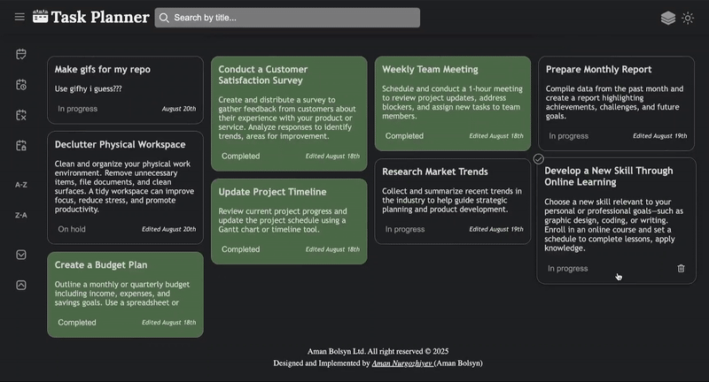
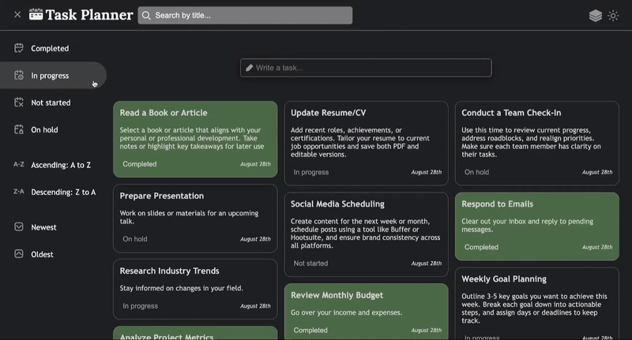
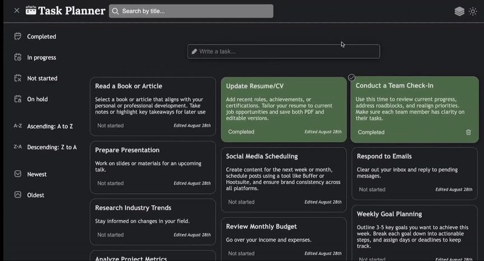

# Task Planner

Browser application called task-planner is capable of: 

+ Make a list of tasks to track progress.
+ Mark tasks as completed, on hold, in progress or not started
+ Search tasks by title.
+ Filter tasks by task status.
+ Sort the tasks list by date and tittle 
+ Select multiple tasks to perform various operations like deletion and status change.
+ Drag and drop tasks to change their positions.
+ Persist the task list across browser reloads.
+ Reflect application's state in the URL.
+ Toggle between dark or light mode and column or list view.
+ Responsive design across different screen sizes


## Dark/Light theme and List/Column view toggles 


## Searching, filtering, sorting tasks


## Multiple selection 


## Task creation and editting 



## Installation

Open up your terminal and run this command 
```bash
git clone https://github.com/amanbolsyn/task-planner.git
```

After cloning is finished run this command
```bash
cd task-planner/
```

There to ways of running task-planner locally
1. Running it using Live Server(VS code extension)
2. Or run this command on your terminal instead

```bash
python3 -m http.server 8000
```

Live server will open up the browser window automatically. The second way will provide you the link on your terminal that you have to follow. Unfortunately, the application doesn't work on Safari(working on it). 

Congratulations you installed my application. Hopefully you will be able to enjoy it. 

## Possible improvements 

* Adding animations
* Selecting specific color for task backgrounds 
* Adding bin where person's deleted tasks will be stored extra X amount of days before deleting it permanently.
* Adding backend. At this moment it works only locally.
* Adding URL state reflection for edit form. Edit form that was opened can be saved in URL. 
* Adding tooltips for filter/sort icons when burger menu is inactive.
* Separate SVG files from HTML. It is cluttered right now(Couldn't achieve that)
* Pinned tasks

## Bugs 

+ Drag and drop feature on mobile devise doesn't work.
+ Form for new tasks doesn't work on Safari because of mouseover event
+ CSS for task cards doesn't work on Safari 
+ Solve hover features on mobile devices
+ Fix button layout inside edit and new task forms

## Resources 

+ [SVG files](https://www.svgrepo.com)
+ [JS documenation](https://developer.mozilla.org/en-US/docs/Web/JavaScript)
+ [Project by Alem School](https://alem.school)

## Contributing

Pull requests are welcome. For major changes, please open an issue first
to discuss what you would like to change.

## License

Cannot be used for commercial purposes.